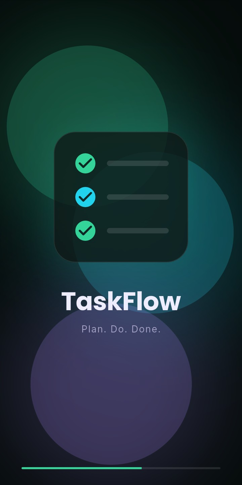
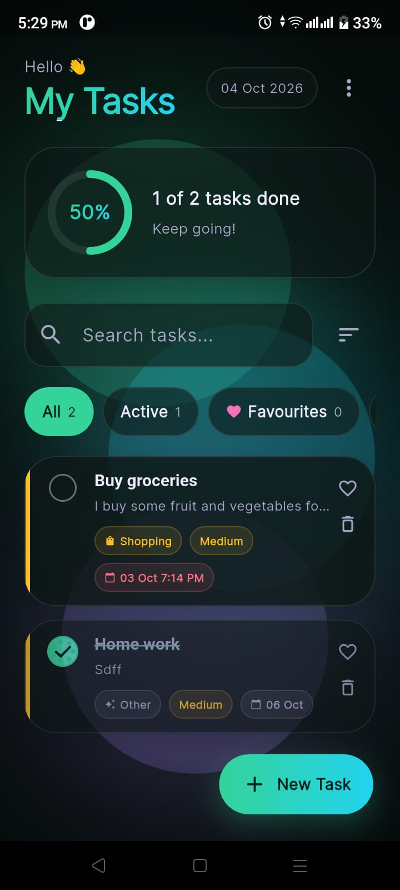
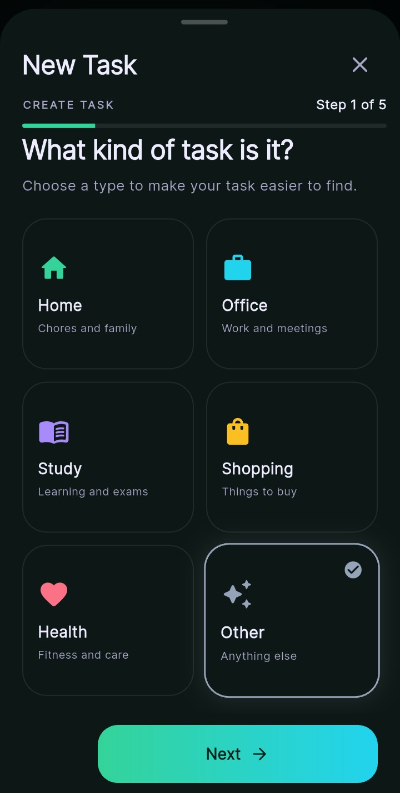
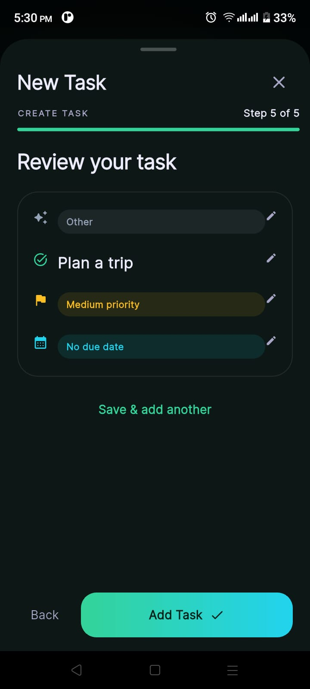

<div align="center">

# ✅ TaskFlow

### 📝 Plan your day. Stay on track. Get things done.


</div>

---

## 📖 About

**TaskFlow** is a modern to-do app built with Flutter, featuring a clean dark design and smooth animations. 🌙✨

Add tasks step by step, organize them by category, mark your favourites ❤️, and get a reminder 🔔 at the exact time you choose. Everything is saved on your phone 💾, so your tasks are still there when you reopen the app.

---

## 📸 Screenshots

<div align="center">

| 🚀 Splash | 🏠 Home | 🗂️ Select Task Type | 🎯 Final |
|:---------:|:-------:|:-------------------:|:--------:|
| [](assets/images/splash.jpeg) | [](assets/images/home.jpeg) | [](assets/images/tashSelect.jpeg) | [](assets/images/final.jpeg) |

*👆 Click any screenshot to view it in full size.*

</div>

---

## ✨ Features

| | Feature | Description |
|---|---------|-------------|
| 🧭 | **Step-by-step Add Task** | Choose type, write details, set priority, pick date and time, then review |
| 🗂️ | **Categories** | Home 🏠, Office 💼, Study 📚, Shopping 🛒, Health ❤️‍🩹 and Other ✨ |
| 🚦 | **Priority levels** | Low 🟢, Medium 🟡 and High 🔴 with colour coding |
| 🔔 | **Reminders** | Get notified at the due time, 10 minutes or 1 hour before |
| ❤️ | **Favourites** | Mark important tasks and view them in a separate tab |
| 🔍 | **Search and filters** | All, Active, Favourites and Completed |
| 📊 | **Progress tracker** | See how many tasks you have completed |
| 🗑️ | **Delete with Undo** | Swipe to delete, and bring it back with Undo |
| 🔒 | **Locked completed tasks** | Completed tasks cannot be edited or marked pending again |
| 💾 | **Local storage** | Your tasks stay saved after closing the app |
| 🎨 | **Modern design** | Dark Material 3 look with smooth animations |

---

## 🔄 How It Works

```
🚀 Splash ──► 🏠 Home ──► ➕ New Task
                              │
        🗂️ Type ─► ✍️ Details ─► 🚦 Priority ─► 📅 Due date ─► ✅ Review
                              │
                              ▼
            🔔 Reminder  ·  ❤️ Favourite  ·  ✔️ Complete  ·  🗑️ Delete
```

---

## 🛠️ Tech Stack

| 📦 Package | 🎯 Purpose |
|------------|-----------|
| `provider` | State management |
| `shared_preferences` | Local storage |
| `flutter_local_notifications` | Task reminders |
| `timezone` + `flutter_timezone` | Correct reminder times |
| `google_fonts` | Poppins and Inter fonts |
| `flutter_animate` | Smooth animations |

---

## 📂 Project Structure

```
lib/
├── main.dart
├── 🎨 theme/        → colors, fonts, shapes
├── 🧩 models/       → Task model
├── ⚙️ services/     → storage and notifications
├── 🧠 providers/    → task state (add, edit, delete, complete, favourite)
├── 📱 screens/      → splash and home screens
├── 🧱 widgets/      → task card, add/edit wizard, reusable widgets
├── 🔧 utils/        → snackbar helper
└── 💡 data/         → quick task suggestions
```

---

## 🚀 Getting Started

**1️⃣ Clone the repository**
```bash
git clone <your-repo-link>
cd todo_app
```

**2️⃣ Install dependencies**
```bash
flutter pub get
```

**3️⃣ Run the app** on an Android phone or emulator
```bash
flutter run
```

> 💡 **Note:** Reminder notifications work on Android and iOS only (not on web or desktop). On some phones (Realme, Oppo, Xiaomi), set the app's battery usage to **Unrestricted** so reminders arrive on time. 🔋

---

## 👨‍💻 Author

**Muhammad Asrar**
📱 Flutter Developer

[](https://github.com/Asrar-Ashraf)
[](https://linkedin.com/in/muhammad-asrar-ashraf)

---

<div align="center">

⭐ **If you like this project, give it a star!** ⭐

Made with ❤️ using Flutter

</div>
